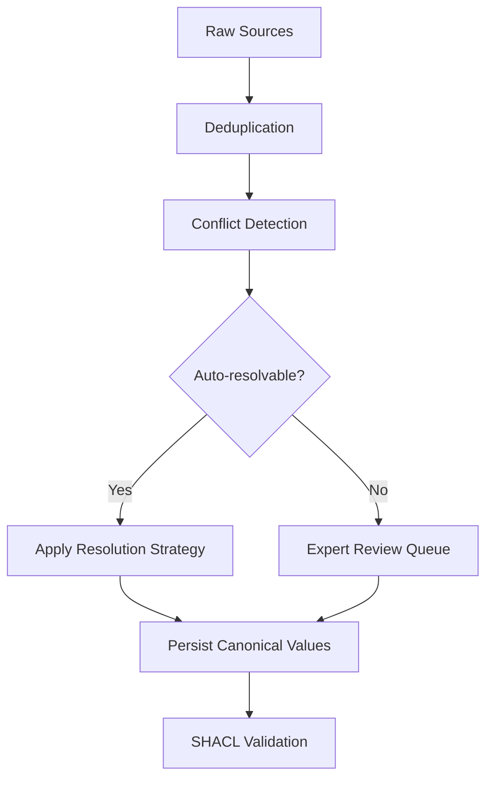

**[English](conflict-resolution.md)** · **简体中文（当前）**

`ConflictDetector` 用于发现多个来源对同一规范实体存在分歧的属性，而 `ConflictResolver` 则按属性应用解决策略 —— 可信度加权投票、最新值、专家评审等 —— 以产出单一的可解决值，并附带完整的审计追踪。请在去重之后、SHACL 校验之前运行它。

<Info>
  请在去重之后、SHACL 校验之前运行冲突检测。去重会移除重复节点；冲突解决则调和同一规范实体上相互矛盾的属性值。如果顺序颠倒 —— 在去重之前检测冲突 —— 会在本应先合并的实体之间产生虚假冲突。
</Info>

<a id="what-is-conflict-resolution"></a>
## 什么是冲突解决？

当你合并来自多个来源的数据时，同一个现实世界实体 —— 一位客户、一款产品、一个威胁攻击者、一种药物化合物 —— 往往会带有相互矛盾的属性值。一个数据库说客户的邮箱是 `alice@example.com`；另一个说是 `alice.smith@example.com`。一个安全数据馈送给某 CVE 评分为 10.0；另两个则分别评为 9.1 和 9.5。

**冲突解决**是一个系统化的过程：决定哪个值最值得信任，并附证据记录该决策，从而使规范实体的每个属性最终都有一个可辩护、可审计的单一值。

<a id="key-concepts"></a>
### 关键概念

**规范实体（Canonical entity）** —— 某个现实世界事物的唯一权威记录。去重之后，每个实体在图谱中恰好拥有一个规范节点。冲突解决决定了哪些属性值应当落到该节点上。

**冲突值（Conflicting values）** —— 同一规范实体的同一属性上被断言的两个或多个不同值，每个值由不同的来源报告。

**可信度得分（Credibility score）** —— 你附加到每条来源记录上的 0.0 到 1.0 之间的数值，表示该来源的可靠程度。政府登记库可能是 0.99；抓取的博客可能是 0.30。这些值由你提供；Semantica 在 `CREDIBILITY_WEIGHTED` 解决过程中使用它们。

**置信度得分（Confidence score）** —— 解决器在解决*之后计算*出的 0.0 到 1.0 之间的数值，反映结果的确定性程度。全票通过会产生高置信度；可信度相近的来源之间势均力敌的分裂则会产生较低置信度。该得分出现在 `ResolutionResult.confidence` 上，应被解读为一个信号，而非可解决值必然正确的保证。

**解决策略（Resolution strategy）** —— 选取获胜值的规则：多数投票、可信度加权平均、最新时间戳等。完整列表见[解决策略一览](#resolution-strategies-at-a-glance)。

**审计追踪（Audit trail）** —— 每一项解决决策的完整记录：冲突 ID、所用策略、可解决值、参考的来源以及置信度得分。由 `resolver.get_resolution_history()` 返回。

**溯源感知解决（Provenance-aware resolution）** —— 不仅记录获胜值，还记录它来自哪个来源的解决方式。每个 `ResolutionResult` 都带有一个 `sources_used` 字段，因此你始终可以将规范值追溯至其源头 —— 这在受监管环境中至关重要。

<a id="why-use-conflict-resolution"></a>
## 为什么要使用冲突解决？

- **多源流水线总会产生分歧。** 更新节奏、数据录入约定和来源可靠性的差异不可避免。如果没有显式的解决步骤，你会默默偏向某一个来源，且对这一选择不留任何记录。
- **你将获得一份可辩护、可审计的决策日志。** 合规团队、审计师和领域专家需要知道哪个来源胜出以及原因。审计追踪恰好提供这些信息。
- **简单情形自动化；复杂情形升级处理。** 常规分歧 —— 略有差异的名称拼写、过时的时间戳 —— 由算法解决。真正模棱两可的情形 —— 相互冲突的法律分类、不同的临床终点 —— 会被标记给专家评审，而不会阻塞流水线的其余部分。

<a id="when-to-use--when-not-to-use"></a>
## 何时使用 / 何时不应使用

**在以下场景使用冲突解决：**
- 你正在为同一实体合并两个或多个独立来源。
- 来源在属性值上存在分歧，而你需要一个单一的规范值。
- 你需要每一项解决决策的可审计记录。
- 某些冲突在解决之前需要领域专家评审。

**在以下场景跳过冲突解决：**
- **已存在单一权威来源。** 如果某个系统对于给定属性始终正确，直接读取它即可。在单一来源周围叠加解决机制只会增加复杂度而无收益。
- **所有来源始终一致。** 跳过之前请以经验验证这一点；实际中默默的分歧很常见。
- **你希望保留所有冲突值。** 如果保留每个来源的断言比挑选其一更重要，请直接在你的图谱模式中建模溯源，而不是解决为单一获胜者。

<a id="typical-workflow"></a>
## 典型工作流



1. **去重** —— 合并重复节点，使每个实体恰好拥有一个规范记录。冲突解决作用于单一规范实体；在比较不同来源对该实体的说法之前，你必须先识别出它。请参阅[去重](deduplication.zh-CN.md)。
2. **冲突检测** —— 调用 `detect_entity_conflicts()` 一次性发现所有属性分歧，或调用 `detect_value_conflicts()` 针对特定属性。
3. **解决** —— 对每个冲突应用一种策略（`CREDIBILITY_WEIGHTED`、`MOST_RECENT`、`VOTING` 等），或将其路由给专家评审（`EXPERT_REVIEW`）。
4. **持久化规范值** —— 将可解决值写回你的规范实体或图存储。请参阅[持久化可解决值](#persisting-resolved-values)。
5. **SHACL 校验** —— 对可解决后的图谱强制执行结构约束，确认它满足你的本体。请参阅 [SHACL 校验](shacl-validation.zh-CN.md)。

<a id="quick-start-a-beginner-example"></a>
## 快速上手：一个入门示例

在深入领域特定场景之前，下面是穿越该 API 的最短路径。三个系统 —— 一个 CRM、一个 ERP 和一个 LDAP 目录 —— 持有同一位客户略有差异的联系详情。三个中有两个认同规范邮箱为 `alice.smith@example.com`；CRM 持有一个较旧的值。

```python
from semantica.conflicts import ConflictDetector, ConflictResolver, ResolutionStrategy

# 同一客户，三个来源 —— 仅 email 存在分歧
customer_records = [
    {"id": "cust-001", "source": "crm",  "email": "alice@example.com",       "phone": "+1-555-0100"},
    {"id": "cust-001", "source": "erp",  "email": "alice.smith@example.com", "phone": "+1-555-0100"},
    {"id": "cust-001", "source": "ldap", "email": "alice.smith@example.com", "phone": "+1-555-0100"},
]

# 步骤 1：一次性检测所有属性冲突 —— 无需逐个属性命名
detector = ConflictDetector()
conflicts = detector.detect_entity_conflicts(customer_records)

print(f"Conflicts found: {len(conflicts)}")
for c in conflicts:
    print(f"  Property : {c.property_name}")
    print(f"  Values   : {c.conflicting_values}")
    print(f"  Severity : {c.severity}")

# 步骤 2：解决 —— 三个来源中有两个一致，因此多数投票胜出
resolver = ConflictResolver()
results = resolver.resolve_conflicts(conflicts, strategy=ResolutionStrategy.VOTING)

for r in results:
    print(f"\n[{'RESOLVED' if r.resolved else 'REVIEW'}] {r.conflict_id}")
    print(f"  Resolved value : {r.resolved_value}")
    print(f"  Strategy       : {r.resolution_strategy}")
    print(f"  Confidence     : {r.confidence:.0%}")
    print(f"  Sources used   : {r.sources_used}")
```

```text
Conflicts found: 1
  Property : email
  Values   : ['alice@example.com', 'alice.smith@example.com', 'alice.smith@example.com']
  Severity : medium

[RESOLVED] cust-001_email_conflict
  Resolved value : alice.smith@example.com
  Strategy       : voting
  Confidence     : 67%
  Sources used   : ['crm', 'erp', 'ldap']
```

`detect_entity_conflicts()` 自动扫描了 `email` 和 `phone` —— 你并没有显式命名它们。由于 `phone` 在三条记录中完全相同，未为其检测到冲突。邮箱的分歧被解决为 `alice.smith@example.com`，因为三个来源中有两个认同该值。

当一批冲突都应使用同一策略时，请将 `strategy=` 直接传给 `resolve_conflicts()`。当不同的实体-属性组合需要不同策略时，请使用 `set_resolution_rule()` —— 详见[设置按属性的解决规则](#setting-per-property-resolution-rules)。

<a id="detecting-conflicts"></a>
## 检测冲突

`ConflictDetector` 提供三种方法。请根据你的情况选择合适的一种：

| 方法 | 扫描内容 | 何时使用 |
| :--- | :--- | :--- |
| `detect_entity_conflicts(entities)` | 每个实体的所有属性（一次性） | 首轮扫描；你事先不知道哪些属性存在冲突 |
| `detect_value_conflicts(entities, property_name)` | 所有实体上的某个命名属性 | 针对已知热点属性的定向检查 |
| `detect_relationship_conflicts(relationships)` | 同一节点对之间的边类型 | 图谱边中的结构性分歧 |

<a id="scanning-all-properties-at-once-detect_entity_conflicts"></a>
### 一次性扫描所有属性 —— `detect_entity_conflicts`

`detect_entity_conflicts()` 是新流水线的推荐起点。它会检查实体记录上发现的每个属性，并返回所有冲突的一个扁平列表 —— 你无需事先枚举属性。

```python
detector = ConflictDetector()
all_conflicts = detector.detect_entity_conflicts(records)
# 一次调用返回跨所有属性的每一个冲突
```

如果你为特定实体类型注册了冲突字段，请传入 `entity_type` 将检测限制在这些字段：

```python
# 将检测限制为该实体类型已注册的字段
all_conflicts = detector.detect_entity_conflicts(records, entity_type="vulnerability")
```

不传 `entity_type` 时，检测器会检查实体字典上发现的每一个键（排除诸如 `id`、`source` 和 `metadata` 之类的簿记字段）。从这里开始以获得完整全貌，再决定哪些冲突需要哪种解决策略。

<a id="scanning-a-specific-property-detect_value_conflicts"></a>
### 扫描特定属性 —— `detect_value_conflicts`

当你已经知道要检查哪个属性，或希望对每个属性应用不同的检测逻辑时，请使用 `detect_value_conflicts()`。`ConflictDetector` 按实体 ID 对记录分组，然后比较每个来源对该属性的值。任何两个或更多来源报告不同值的实体都会产生一个 `Conflict` 对象。

```python
from semantica.conflicts import ConflictDetector, ConflictResolver, ResolutionStrategy

# 三个权威来源对同一 CVE —— 都可信，都不一致
cve_records = [
    {
        "id": "cve-2024-3400",
        "source": "nvd",
        "cvss_score": 10.0,
        "exploit_status": "unconfirmed",
        "vector": "AV:N/AC:L/PR:N/UI:N/S:C/C:H/I:H/A:H",
        "metadata": {"timestamp": "2024-04-11T12:00:00Z"},
    },
    {
        "id": "cve-2024-3400",
        "source": "commercial_feed",
        "cvss_score": 9.1,
        "exploit_status": "in_wild",
        "vector": "AV:N/AC:L/PR:N/UI:N/S:U/C:H/I:H/A:H",
        "metadata": {"timestamp": "2024-04-12T15:30:00Z"},
    },
    {
        "id": "cve-2024-3400",
        "source": "vendor_paloalto",
        "cvss_score": 9.5,
        "exploit_status": "in_wild",
        "vector": "AV:N/AC:H/PR:N/UI:N/S:C/C:H/I:H/A:H",
        "metadata": {"timestamp": "2024-04-12T12:00:00Z"},
    },
]

detector = ConflictDetector()

# 检测 CVSS 评分属性上的分歧
score_conflicts = detector.detect_value_conflicts(cve_records, property_name="cvss_score")
exploit_conflicts = detector.detect_value_conflicts(cve_records, property_name="exploit_status")

print(f"CVSS score conflicts  : {len(score_conflicts)}")
print(f"Exploit status conflicts: {len(exploit_conflicts)}")

for c in score_conflicts:
    print(f"\nConflict: {c.conflict_id}")
    print(f"  Entity   : {c.entity_id}")
    print(f"  Property : {c.property_name}")
    print(f"  Values   : {c.conflicting_values}")   # [10.0, 9.1, 9.5]
    print(f"  Severity : {c.severity}")              # 'medium' —— 数值差异 < 1000
    print(f"  Sources  : {[s['document'] for s in c.sources]}")
    print(f"  Action   : {c.recommended_action}")
```

```text
CVSS score conflicts  : 1
Exploit status conflicts: 1

Conflict: cve-2024-3400_cvss_score_conflict
  Entity   : cve-2024-3400
  Property : cvss_score
  Values   : [10.0, 9.1, 9.5]
  Severity : medium
  Sources  : ['nvd', 'commercial_feed', 'vendor_paloalto']
  Action   : Multiple conflicting values detected. Manual review recommended.
```

每个 `Conflict` 都捕获了完整画面：哪个实体、哪个属性、每一个分歧值，以及每个值由哪个来源报告。这已经足够构建一个评审队列 —— 但目标是按照你设定的规则自动解决它们。

<a id="setting-per-property-resolution-rules"></a>
## 设置按属性的解决规则

`set_resolution_rule(entity_id, property_name, strategy)` 为某个特定的实体-属性组合注册一条策略。解决器将规则存储在键 `entity_id.property_name` 之下，并在你调用 `resolve_conflicts()` 时自动应用。

由于规则同时按实体 ID 和属性名作键，`set_resolution_rule()` 是实体特定的。没有通配符能一次性对全部实体或全部属性应用规则。

**何时使用 `set_resolution_rule()`：** 当不同的实体-属性组合需要不同策略时使用。例如，一个实体的 `legal_name` 可能使用 `CREDIBILITY_WEIGHTED`，而其 `last_updated` 使用 `MOST_RECENT`。为每个组合注册规则，能让单次 `resolve_conflicts()` 调用在一次遍历中正确处理所有组合。

**何时直接向 `resolve_conflicts()` 传入 `strategy=`：** 如果一批中的每个冲突都应使用同一策略，请直接传给 `resolve_conflicts()`，而不是为每个实体-属性对注册规则：

```python
# 每个冲突使用同一策略 —— 无需按属性设置规则
results = resolver.resolve_conflicts(all_conflicts, strategy=ResolutionStrategy.CREDIBILITY_WEIGHTED)
```

这比在循环中为每个实体调用 `set_resolution_rule()` 只为到处应用同一策略要更整洁。

**CVE 示例的按属性规则：**

```python
resolver = ConflictResolver()

# 注册来源可信度得分，以便 CREDIBILITY_WEIGHTED 使用
resolver.source_tracker.set_source_credibility("nvd", 0.98)
resolver.source_tracker.set_source_credibility("commercial_feed", 0.91)
resolver.source_tracker.set_source_credibility("vendor_paloalto", 0.87)

# 对于此 CVE，NVD 是评分的最权威来源。
# CREDIBILITY_WEIGHTED 使用已注册的来源可信度
# 为投票加权 —— NVD 的 0.98 将压过商业数据馈送的 0.91。
resolver.set_resolution_rule(
    "cve-2024-3400",
    "cvss_score",
    ResolutionStrategy.CREDIBILITY_WEIGHTED,
)

# 利用状态具有时效性：商业数据馈送和厂商都
# 观察到了在野利用，这比 NVD 最初的
# 未确认评估更及时。MOST_RECENT 从其元数据中
# 时间戳最新的来源选取值。
resolver.set_resolution_rule(
    "cve-2024-3400",
    "exploit_status",
    ResolutionStrategy.MOST_RECENT,
)
```

你可以在检测之前或之后设置规则 —— 解决器在调用 `resolve_conflicts()` 时才会惰性应用它们。

<a id="resolving-the-batch"></a>
## 解决整批冲突

将所有检测到的冲突传给 `resolve_conflicts()`。对每个冲突，解决器会查找是否为该实体-属性组合注册了规则。如果找到，就应用该策略。如果未设置，则回落到默认策略（投票，除非你在构造器中覆盖）。

```python
all_conflicts = score_conflicts + exploit_conflicts

results = resolver.resolve_conflicts(all_conflicts)

for r in results:
    status = "RESOLVED" if r.resolved else "REVIEW REQUIRED"
    print(f"[{status}] {r.conflict_id}")
    print(f"  Resolved value : {r.resolved_value}")
    print(f"  Strategy used  : {r.resolution_strategy}")
    print(f"  Confidence     : {r.confidence:.0%}")
    print(f"  Sources used   : {r.sources_used}")
    print(f"  Notes          : {r.resolution_notes}")
    print()
```

```text
[RESOLVED] cve-2024-3400_cvss_score_conflict
  Resolved value : 10.0
  Strategy used  : credibility_weighted
  Confidence     : 36%
  Sources used   : ['nvd', 'commercial_feed', 'vendor_paloalto']
  Notes          : Resolved by credibility-weighted voting (weight: 0.98)

[RESOLVED] cve-2024-3400_exploit_status_conflict
  Resolved value : in_wild
  Strategy used  : most_recent
  Confidence     : 80%
  Sources used   : ['commercial_feed']
  Notes          : Resolved by most recent value
```

NVD 赢得了 CVSS 评分 —— 其可信度权重（0.98）胜过商业数据馈送（0.91）和厂商（0.87），因此 10.0 成为规范评分。利用状态被解决为 `in_wild` —— 商业数据馈送和厂商公告都比 NVD 的初始分诊更近，且二者都报告了活跃利用。

<a id="handling-conflicts-that-need-human-judgment"></a>
## 处理需要人工判断的冲突

并非每个冲突都能自动解决。关于某金融工具法律分类，或关于某患者当前用药清单的分歧，后果太严重，不适合用算法解决。将这些标记为评审，而不阻塞批次的其余部分：

```python
from semantica.conflicts import ConflictDetector, ConflictResolver, ResolutionStrategy

# 药物试验数据：有效性一致，主要终点存在争议
trial_records = [
    {"id": "dapagliflozin", "source": "declare_timi58",
     "primary_endpoint": "MACE",               "hba1c_reduction_pct": 0.54},
    {"id": "dapagliflozin", "source": "dapa_hf",
     "primary_endpoint": "HF_hospitalization", "hba1c_reduction_pct": 0.48},
    {"id": "dapagliflozin", "source": "meta_analysis",
     "primary_endpoint": "HbA1c_reduction",    "hba1c_reduction_pct": 0.52},
]

detector = ConflictDetector()
efficacy_conflicts  = detector.detect_value_conflicts(trial_records, "hba1c_reduction_pct")
endpoint_conflicts  = detector.detect_value_conflicts(trial_records, "primary_endpoint")

resolver = ConflictResolver()

# 注册来源可信度得分
resolver.source_tracker.set_source_credibility("declare_timi58", 0.92)
resolver.source_tracker.set_source_credibility("dapa_hf", 0.95)
resolver.source_tracker.set_source_credibility("meta_analysis", 0.88)

# 有效性：跨试验的可信度加权 —— 荟萃分析（0.88）与
# 两项 RCT（0.92、0.95）将产出一个加权解决结果。
resolver.set_resolution_rule(
    "dapagliflozin", "hba1c_reduction_pct", ResolutionStrategy.CREDIBILITY_WEIGHTED
)

# 主要终点：每项试验测量了不同的事物。这不是一个
# 可以自动解决的冲突 —— 必须由临床医生决定哪个终点适用于该用例。
resolver.set_resolution_rule(
    "dapagliflozin", "primary_endpoint", ResolutionStrategy.EXPERT_REVIEW
)

all_conflicts = efficacy_conflicts + endpoint_conflicts
results = resolver.resolve_conflicts(all_conflicts)

auto_resolved = [r for r in results if r.resolved]
for_review    = [r for r in results if not r.resolved]

print(f"Auto-resolved : {len(auto_resolved)}")
print(f"Expert review : {len(for_review)}")

# 为临床团队导出评审队列
import json
review_queue = [
    {
        "conflict_id": r.conflict_id,
        "notes": r.resolution_notes,
        "metadata": r.metadata,
    }
    for r in for_review
]
with open("expert_review_queue.json", "w") as fh:
    json.dump(review_queue, fh, indent=2, default=str)
```

```text
Auto-resolved : 1
Expert review : 1   # primary_endpoint —— EXPERT_REVIEW 意味着 resolved=False
```

`EXPERT_REVIEW` 会在结果上设置 `resolved=False`。冲突在图谱中保持未解决状态，metadata 字段携带 `requires_expert_review: True`，而评审队列 JSON 为你的临床团队提供了做出决定所需的全部信息。

<a id="persisting-resolved-values"></a>
## 持久化可解决值

`resolve_conflicts()` 返回 `ResolutionResult` 对象 —— 它不会自动将可解决值写回你的图谱或实体存储。这一步需要你自己实现，使用你的流水线所采用的任何存储层。

最直接的方式是将每个 `ResolutionResult` 与其原始 `Conflict` 对象配对 —— 两个列表以相同顺序返回 —— 并将获胜值写到你的规范实体上：

```python
# canonical_entity 是你的权威记录 —— 一个字典、图谱节点、数据库行等
canonical_entity = {"id": "cve-2024-3400", "cvss_score": None, "exploit_status": None}

for conflict, result in zip(all_conflicts, results):
    if result.resolved:
        canonical_entity[conflict.property_name] = result.resolved_value
        # 记录溯源：记录该值来自哪个来源
        print(f"  {conflict.property_name} = {result.resolved_value} "
              f"(from {result.sources_used}, confidence {result.confidence:.0%})")

# 将 canonical_entity 持久化到你的图存储、数据库或下游系统。
```

```text
  cvss_score = 10.0 (from ['nvd', 'commercial_feed', 'vendor_paloalto'], confidence 36%)
  exploit_status = in_wild (from ['commercial_feed'], confidence 80%)
```

需要注意几点：

- **`resolved=False` 的冲突** —— 被标记为专家或人工评审 —— 在人工做出决定之前不应写入规范记录。请将它们保留在评审队列中。
- **置信度是一个信号，而非保证。** 72% 的置信度得分意味着解决器对其决策有合理但非一致的证据。在将低置信度结果写入生产环境之前，应以更严格的审查对待。
- **追踪溯源。** `result.sources_used` 告诉你哪个来源的值获胜。如果你的合规要求需要完整证据链，请将其与规范值一同存储。

<a id="reviewing-the-full-audit-trail"></a>
## 查阅完整审计追踪

一次解决运行之后，`get_resolution_history()` 返回自解决器实例化以来所做的每一项决策。这是你的合规日志：

```python
history = resolver.get_resolution_history()

print(f"Total resolutions logged: {len(history)}")
for r in history:
    status = "RESOLVED" if r.resolved else "PENDING"
    print(f"[{status}] {r.conflict_id}")
    print(f"  Strategy   : {r.resolution_strategy}")
    print(f"  Value      : {r.resolved_value}")
    print(f"  Confidence : {r.confidence:.0%}")
```

将其与来自检测器的完整冲突报告结合，可获得跨所有运行的聚合统计：

```python
report = detector.get_conflict_report()

print(f"Total conflicts detected  : {report['total_conflicts']}")
print(f"By type                   : {report['by_type']}")
print(f"By severity               : {report['by_severity']}")
# Total conflicts detected  : 6
# By type                   : {'value_conflict': 6}
# By severity               : {'medium': 6}
```

该报告聚合了检测器在其生命周期内看到的每一个冲突 —— 对流水线监控很有用，也可用于识别哪些实体类型或数据来源产生最多分歧。

<a id="detecting-relationship-conflicts"></a>
## 检测关系冲突

值冲突存在于属性上。关系冲突存在于边上 —— 两个来源对同一节点对断言相互矛盾的连接：

```python
# 两个情报来源对 APT29 是否利用此 CVE 持不同意见
relationships = [
    {"source": "apt29", "target": "cve-2024-3400",
     "type": "EXPLOITS",     "origin": "mandiant"},
    {"source": "apt29", "target": "cve-2024-3400",
     "type": "UNRELATED_TO", "origin": "crowdstrike"},
]

rel_conflicts = detector.detect_relationship_conflicts(relationships)
for c in rel_conflicts:
    print(f"Relationship conflict: {c.conflict_id}")
    print(f"  Edge type values: {c.conflicting_values}")
    print(f"  Severity: {c.severity}")
```

关系冲突通常需要专家评审而非投票，因为相互冲突的边类型往往反映的是真正不同的情报评估，而非数据录入错误。

<a id="domain-examples"></a>
## 领域示例

<Tabs>

<Tab title="国防 —— CTI/威胁情报">

一个威胁情报平台合并来自 Mandiant、CrowdStrike 和一个开源博客的攻击者档案。三个来源一致认为 APT29 是俄罗斯背景且以间谍为动机，但在其首次被观察到的时间上存在分歧 —— 关键的是 —— 一个来源将其归因于中国。低可信度来源（博客，0.30）应当输给高可信度来源（Mandiant 0.95、CrowdStrike 0.92），因为后者彼此一致。

可信度加权解决能干净地处理这一点：博客的错误归因被两家权威厂商的合计权重淹没。`first_seen` 日期的分歧（2008 对 2009）也由可信度权重解决，Mandiant 的 2008 年日期获胜。

```python
from semantica.conflicts import ConflictDetector, ConflictResolver, ResolutionStrategy

actor_profiles = [
    {"id": "apt29", "source": "mandiant",    "nation_state": "Russia",
     "first_seen": "2008"},
    {"id": "apt29", "source": "crowdstrike", "nation_state": "Russia",
     "first_seen": "2009"},
    {"id": "apt29", "source": "oss_blog",    "nation_state": "China",  # wrong
     "first_seen": "2015"},
]

detector = ConflictDetector()
nation_conflicts     = detector.detect_value_conflicts(actor_profiles, "nation_state")
first_seen_conflicts = detector.detect_value_conflicts(actor_profiles, "first_seen")

resolver = ConflictResolver()
resolver.source_tracker.set_source_credibility("mandiant", 0.95)
resolver.source_tracker.set_source_credibility("crowdstrike", 0.92)
resolver.source_tracker.set_source_credibility("oss_blog", 0.30)

resolver.set_resolution_rule("apt29", "nation_state", ResolutionStrategy.CREDIBILITY_WEIGHTED)
resolver.set_resolution_rule("apt29", "first_seen",   ResolutionStrategy.CREDIBILITY_WEIGHTED)

results = resolver.resolve_conflicts(nation_conflicts + first_seen_conflicts)
for r in results:
    print(f"{r.conflict_id}: {r.resolved_value!r}  [{r.confidence:.0%} confidence]")
    # apt29_nation_state_conflict: 'Russia'  [86% confidence]
    # apt29_first_seen_conflict:   '2008'    [44% confidence]
    # 博客的中国归因（权重 0.30）输给了 Mandiant+CrowdStrike（0.95+0.92）。

history = resolver.get_resolution_history()
print(f"Audit log entries: {len(history)}")
```

</Tab>

<Tab title="安全 —— SOC/事件响应">

一个漏洞管理系统从 NVD、MITRE 和一份厂商公告为同一 CVE 摄取 CVSS 评分。NVD 和 MITRE 都是权威的；厂商在评分上有保守自保的利益。可信度加权解决让 NVD（0.98）和 MITRE（0.96）压过厂商（0.90），产出一个反映独立权威共识的规范评分。

CVSS 向量字符串也存在冲突 —— scope 字段（`S:C` 对 `S:U`）反映了一种真正的解读分歧，影响该 CVE 是否被归类为网络枢轴风险。两个冲突都得到相同的可信度加权处理。

```python
from semantica.conflicts import ConflictDetector, ConflictResolver, ResolutionStrategy

cve_records = [
    {"id": "cve-2024-3400", "source": "nvd",
     "cvss_score": 10.0, "vector": "AV:N/AC:L/PR:N/UI:N/S:C/C:H/I:H/A:H"},
    {"id": "cve-2024-3400", "source": "mitre",
     "cvss_score": 9.8,  "vector": "AV:N/AC:L/PR:N/UI:N/S:U/C:H/I:H/A:H"},
    {"id": "cve-2024-3400", "source": "paloalto",
     "cvss_score": 9.5,  "vector": "AV:N/AC:H/PR:N/UI:N/S:C/C:H/I:H/A:H"},
]

detector = ConflictDetector()
score_conflicts  = detector.detect_value_conflicts(cve_records, "cvss_score")
vector_conflicts = detector.detect_value_conflicts(cve_records, "vector")

resolver = ConflictResolver()
resolver.source_tracker.set_source_credibility("nvd", 0.98)
resolver.source_tracker.set_source_credibility("mitre", 0.96)
resolver.source_tracker.set_source_credibility("paloalto", 0.90)

resolver.set_resolution_rule(
    "cve-2024-3400", "cvss_score", ResolutionStrategy.CREDIBILITY_WEIGHTED
)
resolver.set_resolution_rule(
    "cve-2024-3400", "vector", ResolutionStrategy.CREDIBILITY_WEIGHTED
)

results = resolver.resolve_conflicts(score_conflicts + vector_conflicts)
for r in results:
    if r.resolved:
        print(f"Canonical {r.conflict_id.split('_')[2]}: {r.resolved_value}  "
              f"({r.confidence:.0%} confidence)")
    # Canonical cvss_score: 10.0   (35% confidence)  —— NVD 胜出
    # Canonical vector: AV:N/AC:L/PR:N/UI:N/S:C/C:H/I:H/A:H  (35% confidence)
```

</Tab>

<Tab title="生命科学 —— 临床/制药">

一个药物安全知识图谱合并了来自三项研究的达格列净试验数据：DECLARE-TIMI 58、DAPA-HF 和一项荟萃分析。HbA1c 降幅数值因每项研究入组了不同人群而异。主要终点因每项试验旨在回答不同的临床问题而异 —— 这是真正的科学区别，而非数据错误。

有效性数值可以按可信度加权；存在争议的终点必须进入专家评审。这种分开处理 —— 能自动解决的自动解决，不能的升级处理 —— 是受监管数据环境的通用模式。

```python
from semantica.conflicts import ConflictDetector, ConflictResolver, ResolutionStrategy

drug_records = [
    {"id": "dapagliflozin", "source": "declare_timi58",
     "hba1c_reduction_pct": 0.54, "primary_endpoint": "MACE"},
    {"id": "dapagliflozin", "source": "dapa_hf",
     "hba1c_reduction_pct": 0.48, "primary_endpoint": "HF_hospitalization"},
    {"id": "dapagliflozin", "source": "meta_analysis",
     "hba1c_reduction_pct": 0.52, "primary_endpoint": "HbA1c_reduction"},
]

detector = ConflictDetector()
efficacy_conflicts = detector.detect_value_conflicts(drug_records, "hba1c_reduction_pct")
endpoint_conflicts = detector.detect_value_conflicts(drug_records, "primary_endpoint")

resolver = ConflictResolver()
resolver.source_tracker.set_source_credibility("declare_timi58", 0.92)
resolver.source_tracker.set_source_credibility("dapa_hf", 0.95)
resolver.source_tracker.set_source_credibility("meta_analysis", 0.88)

resolver.set_resolution_rule(
    "dapagliflozin", "hba1c_reduction_pct", ResolutionStrategy.CREDIBILITY_WEIGHTED
)
resolver.set_resolution_rule(
    "dapagliflozin", "primary_endpoint", ResolutionStrategy.EXPERT_REVIEW
    # resolved=False —— 排入临床医生评审队列，不自动解决
)

results = resolver.resolve_conflicts(efficacy_conflicts + endpoint_conflicts)
auto   = [r for r in results if r.resolved]
review = [r for r in results if not r.resolved]

print(f"Auto-resolved  : {len(auto)}")
for r in auto:
    print(f"  {r.conflict_id}: {r.resolved_value}  [{r.confidence:.0%}]")
    # dapagliflozin_hba1c_reduction_pct_conflict: 0.48  [35%]

print(f"Expert queue   : {len(review)}")
for r in review:
    print(f"  {r.conflict_id} — {r.resolution_notes}")
    # dapagliflozin_primary_endpoint_conflict — Flagged for expert review
```

</Tab>

<Tab title="银行 —— 风险/合规">

一个信用风险图谱合并来自 CRM、全球 LEI 登记库和一家信用局的 corporate client 数据。LEI 登记库是实体名称和行业代码的法律权威 —— 其可信度应设为 1.0（或被视为权威）。CRM 和信用局可能持有过时或缩写的名称；LEI 登记库持有官方注册的法律名称。

为 `legal_name` 和 `sic_code` 设置 `CREDIBILITY_WEIGHTED` 解决，并让 LEI 登记库携带 0.99 的可信度得分，可确保法律权威值始终获胜，并为下一次监管检查提供完整审计证据。

```python
from semantica.conflicts import ConflictDetector, ConflictResolver, ResolutionStrategy

client_records = [
    {"id": "corp-acme-uk", "source": "crm",
     "legal_name": "ACME UK Ltd",                "sic_code": "7372"},
    {"id": "corp-acme-uk", "source": "lei_registry",
     "legal_name": "ACME United Kingdom Limited", "sic_code": "7371"},
    {"id": "corp-acme-uk", "source": "credit_bureau",
     "legal_name": "ACME UK Ltd",                "sic_code": "7372"},
]

detector = ConflictDetector()
name_conflicts = detector.detect_value_conflicts(client_records, "legal_name")
sic_conflicts  = detector.detect_value_conflicts(client_records, "sic_code")

resolver = ConflictResolver()
resolver.source_tracker.set_source_credibility("lei_registry", 0.99)
resolver.source_tracker.set_source_credibility("credit_bureau", 0.50)
resolver.source_tracker.set_source_credibility("crm", 0.40)

resolver.set_resolution_rule(
    "corp-acme-uk", "legal_name", ResolutionStrategy.CREDIBILITY_WEIGHTED
)
resolver.set_resolution_rule(
    "corp-acme-uk", "sic_code", ResolutionStrategy.CREDIBILITY_WEIGHTED
)

results = resolver.resolve_conflicts(name_conflicts + sic_conflicts)
for r in results:
    print(f"Canonical {r.conflict_id.split('_')[1]}: {r.resolved_value!r}  "
          f"[{r.confidence:.0%}]")
    # Canonical legal_name: 'ACME United Kingdom Limited'  [52%]  —— LEI 登记库胜出
    # Canonical sic_code:   '7371'                         [52%]  —— LEI 登记库胜出

# 为合规报告聚合冲突统计
report = detector.get_conflict_report()
print(f"\nConflict audit:")
print(f"  Total detected : {report['total_conflicts']}")
print(f"  By severity    : {report['by_severity']}")
```

</Tab>

</Tabs>

<a id="resolution-strategies-at-a-glance"></a>
## 解决策略一览

| 策略 | 如何决定 | 最适用于 |
| :--- | :--- | :--- |
| `VOTING` | 最频繁的值获胜 | 3 个以上独立来源；没有明确的权威 |
| `CREDIBILITY_WEIGHTED` | 按来源 `credibility_score` 加权的值 | 来源有已知的可靠性排名 |
| `MOST_RECENT` | 来自时间戳最新的来源的值 | 数据衰减迅速 —— 威胁情报、市场价格 |
| `FIRST_SEEN` | 来自首个断言该值的来源的值 | 主要来源比衍生来源更可靠 |
| `HIGHEST_CONFIDENCE` | 来自 `confidence` 字段最高的来源的值 | 自动抽取器会逐条记录输出置信度得分 |
| `MANUAL_REVIEW` | 标记冲突；`resolved=False` | 低频次、高利害的决策 |
| `EXPERT_REVIEW` | 标记给领域专家队列；`resolved=False` | 需要科学或法律上的消歧 |

<a id="common-pitfalls"></a>
## 常见陷阱

**在去重之前运行冲突解决**
如果同一现实世界实体的重复节点仍然存在，`ConflictDetector` 会把每个重复项当作一个与其它项存在分歧的独立实体 —— 产生本不该存在的虚假冲突。请始终先运行去重。

**忘记持久化可解决值**
`resolve_conflicts()` 返回 `ResolutionResult` 对象；它不会把值写到任何地方。只查看结果然后继续，而不更新规范实体，意味着你的数据实际上没有任何变化。请参阅[持久化可解决值](#persisting-resolved-values)。

**跨大型实体集逐个属性地扫描**
在手动循环中为每个属性调用 `detect_value_conflicts()` 会对数据进行冗余遍历。请改用 `detect_entity_conflicts()` —— 它在单次调用中处理所有属性，是批量检测的推荐起点。

**误解可信度得分**
可信度得分是你基于对来源可靠性的先验知识赋予的权重 —— 而非地面真值。一个用 `set_source_credibility("source", 0.99)` 注册的来源仍然可能出错。`CREDIBILITY_WEIGHTED` 解决会放大你对来源质量的信念；如果这些信念校准不当，解决结果也会如此。在生产环境依赖它们之前，请针对已知地面真值校验得分。

**把可解决值当作绝对真值**
可解决值是在给定来源和策略下最可辩护的答案 —— 不一定是正确的那个。低置信度得分和 `EXPERT_REVIEW` 标记都是在将结果写入规范记录或下游系统之前加以审视的信号。

**在已存在单一权威来源时仍使用冲突解决**
如果某个系统对于给定属性始终正确，直接读取它即可。在单一来源之上叠加冲突解决会增加复杂度，引入不必要的疑虑，并产出不增加任何真实信息的审计追踪。

**在循环中注册规则仅为统一应用一种策略**
仅为对所有实体-属性对应用同一策略而在循环中为每个组合调用 `set_resolution_rule()`，会产生 O(N) 的设置开销却无收益。当一种策略覆盖整批时，请直接将 `strategy=` 传给 `resolve_conflicts()`。

<a id="related-guides"></a>
## 相关指南

- [去重](deduplication.zh-CN.md) —— 在运行冲突检测之前移除重复节点
- [溯源](provenance.zh-CN.md) —— 追踪每个可解决值来自哪个来源，并以加密方式校验审计追踪
- [SHACL 校验](shacl-validation.zh-CN.md) —— 在冲突解决之后强制执行结构约束
- [变更管理](change-management.zh-CN.md) —— 在冲突解决运行前后对图谱进行快照
- [本体管理](ontology.zh-CN.md) —— 将实体类型对齐到共享词汇表，以在模式层面减少类型冲突
